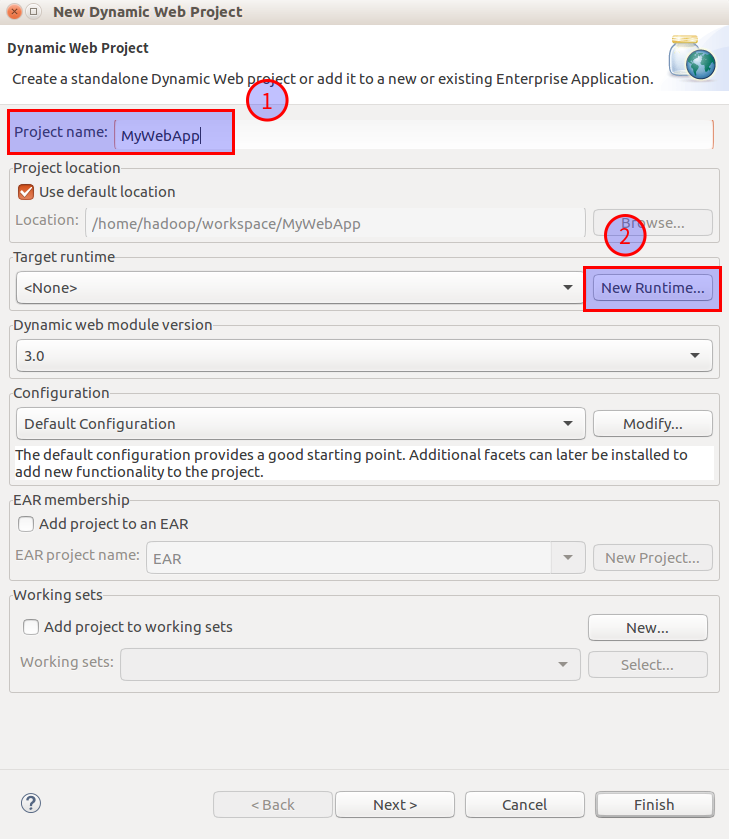
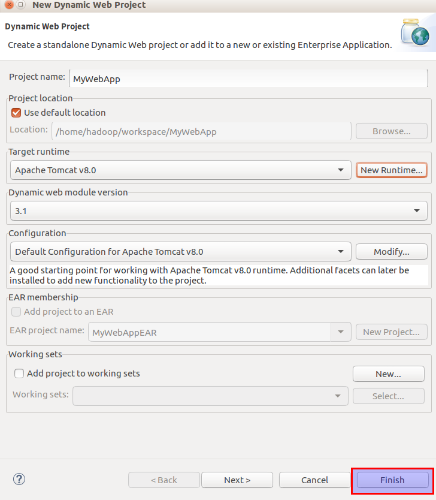
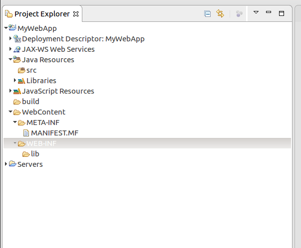
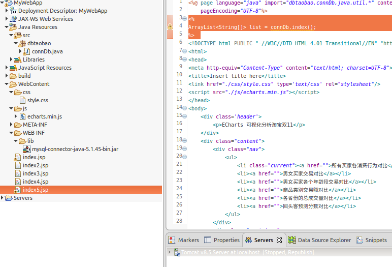
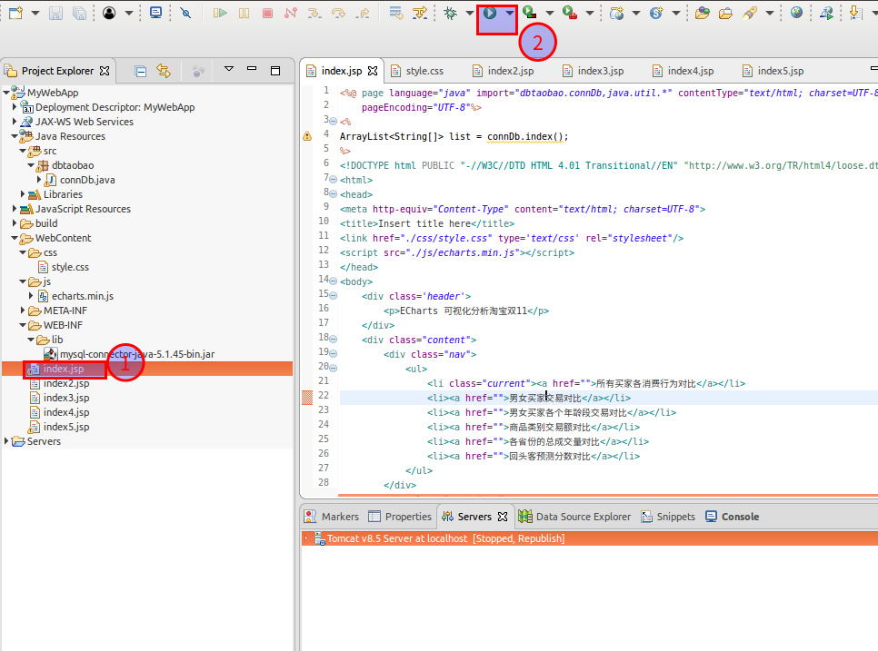
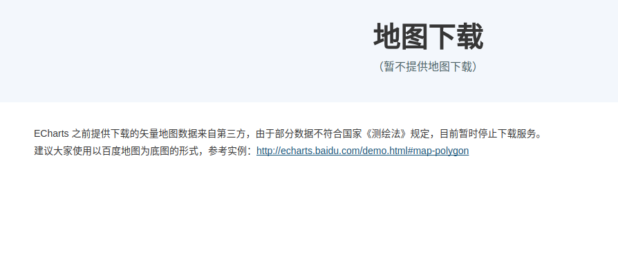
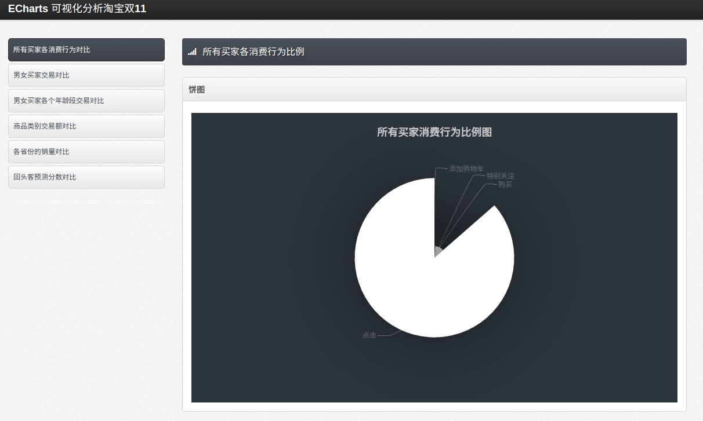
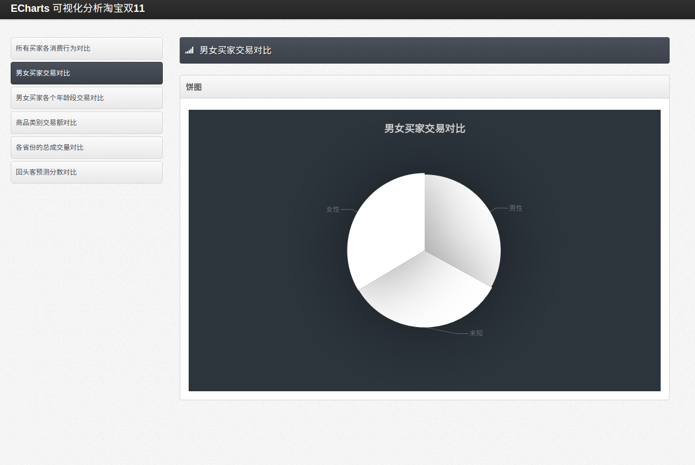
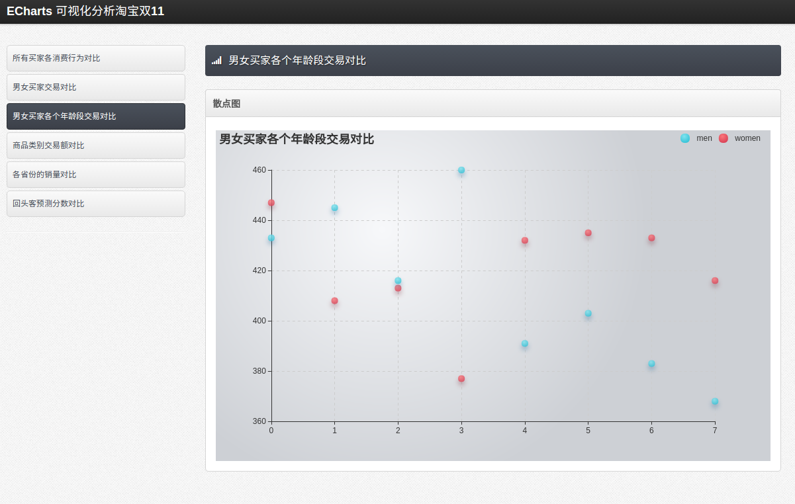
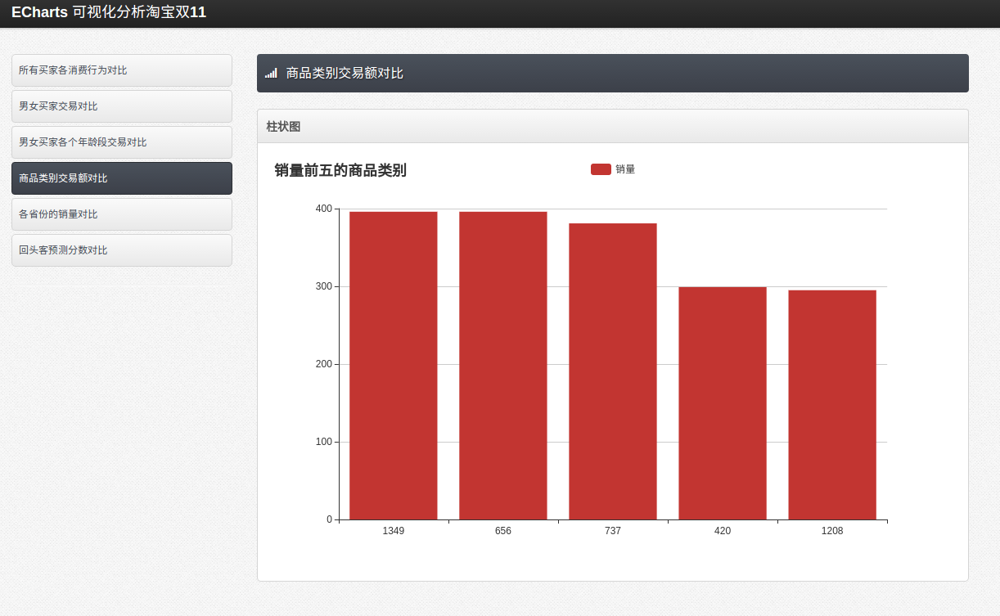

# 利用Spark预测回头客
本教程介绍大数据课程实验案例“淘宝双11数据分析与预测”的第五个步骤，利用ECharts进行数据可视化分析。
ECharts是一个纯 Javascript 的图表库，可以流畅的运行在 PC 和移动设备上，兼容当前绝大部分浏览器（IE8/9/10/11，Chrome，Firefox，Safari等），提供直观，生动，可交互，可高度个性化定制的数据可视化图表。下面将通过Web网页浏览器可视化分析淘宝双11数据。

### 工具
- 可视化：ECharts（安装在Linux系统下）
- 数据库：MySQL（安装在Linux系统下）
- Web应用服务器：tomcat
- IDE:Eclipse

# 实验步骤
### 1. 搭建tomcat+mysql+JSP开发环境
tomcat 已安装在 /usr/local/tomcat 路径下

如果没有启动mysql,执行以下命令启动mysql
```
# service mysql start
```

### 2. 利用Eclipse 新建可视化Web应用
1. 打开Eclipse，点击“File”菜单，或者通过工具栏的“New”创建Dynamic Web Project，弹出向导对话框
填入Project name后，并点击”New Runtime”,如下图所示：



2. 出现New Server Runtime Environment向导对话框,选择“Apache Tomcat v8.0”,点击next按钮,如下图：


3. 选择Tomcat安装文件夹，如下图：

选择tomcat的路径 /usr/local/tomcat

4. 返回New Server Runtime Environment向导对话框，点击finish即可。如下图：


5. 返回Dynamic Web Project向导对话框，点击finish即可。如下图：


6. 这样新建一个Dynamic Web Project就完成了。在Eclipse中展开新建的MyWebApp项目，初始整个项目框架如下：

src文件夹用来存放Java服务端的代码，例如:读取数据库MySQL中的数据
WebContent文件夹则用来存放前端页面文件，例如：前端页面资源css、img、js，前端JSP页面

7. 导入 mysql-connector-java
打开命令行,执行以下指令:
```
cp /usr/local/mysql-connector-java/mysql-connector-java-5.1.46-bin.jar ~/eclipse-workspace/MyWebApp/WebContent/WEB-INF/lib/mysql-connector-java-5.1.46-bin.jar
```
上述操作完成后，即可开发可视化应用了。

### 3. 利用Eclipse 开发Dynamic Web Project应用
整个项目开发完毕的项目结构，如下：

src目录用来存放服务端Java代码，WebContent用来存放前端页面的文件资源与代码。其中css目录用来存放外部样式表文件、font目录用来存放字体文件、img目录存放图片资源文件、js目录存放JavaScript文件，lib目录存放Java与mysql的连接库。
相关代码已经创建好并放在 /data/spark/MyWebApp目录下,读者只需将代码复制文件eclipse创建的项目对应文件夹下即可使用.
创建完所有的文件后，运行MyWebApp，查看我的应用。
首次运行MyWebApp,请按照如下操作，才能启动项目:
双击打开index.jsp文件，然后顶部Run菜单选择：Run As–>Run on Server

出现如下对话框，直接点击finish即可。

以后如果要再次运行MyWebApp,只需要直接启动Tomcat服务器即可，关闭服务器也可以通过如下图关闭。


### 4. 重要代码解析
整个项目，Java后端从数据库中查询的代码都集中在项目文件夹下/Java Resources/src/dbtaobao/connDb.java
代码如下：
```
package dbtaobao;
import java.sql.*;
import java.util.ArrayList;

public class connDb {
    private static Connection con = null;
    private static Statement stmt = null;
    private static ResultSet rs = null;

    //连接数据库方法
    public static void startConn(){
        try{
            Class.forName("com.mysql.jdbc.Driver");
            //连接数据库中间件
            try{
                con = DriverManager.getConnection("jdbc:MySQL://localhost:3306/dbtaobao","root","root");
            }catch(SQLException e){
                e.printStackTrace();
            }
        }catch(ClassNotFoundException e){
            e.printStackTrace();
        }
    }

    //关闭连接数据库方法
    public static void endConn() throws SQLException{
        if(con != null){
            con.close();
            con = null;
        }
        if(rs != null){
            rs.close();
            rs = null;
        }
        if(stmt != null){
            stmt.close();
            stmt = null;
        }
    }
    //数据库双11 所有买家消费行为比例
    public static ArrayList index() throws SQLException{
        ArrayList<String[]> list = new ArrayList();
        startConn();
        stmt = con.createStatement();
        rs = stmt.executeQuery("select action,count(*) num from user_log group by action desc");
        while(rs.next()){
            String[] temp={rs.getString("action"),rs.getString("num")};
            list.add(temp);
        }
            endConn();
        return list;
    }
    //男女买家交易对比
        public static ArrayList index_1() throws SQLException{
            ArrayList<String[]> list = new ArrayList();
            startConn();
            stmt = con.createStatement();
            rs = stmt.executeQuery("select gender,count(*) num from user_log group by gender desc");
            while(rs.next()){
                String[] temp={rs.getString("gender"),rs.getString("num")};
                list.add(temp);
            }
            endConn();
            return list;
        }
        //男女买家各个年龄段交易对比
        public static ArrayList index_2() throws SQLException{
            ArrayList<String[]> list = new ArrayList();
            startConn();
            stmt = con.createStatement();
            rs = stmt.executeQuery("select gender,age_range,count(*) num from user_log group by gender,age_range desc");
            while(rs.next()){
                String[] temp={rs.getString("gender"),rs.getString("age_range"),rs.getString("num")};
                list.add(temp);
            }
            endConn();
            return list;
        }
        //获取销量前五的商品类别
        public static ArrayList index_3() throws SQLException{
            ArrayList<String[]> list = new ArrayList();
            startConn();
            stmt = con.createStatement();
            rs = stmt.executeQuery("select cat_id,count(*) num from user_log group by cat_id order by count(*) desc limit 5");
            while(rs.next()){
                String[] temp={rs.getString("cat_id"),rs.getString("num")};
                list.add(temp);
            }
            endConn();
            return list;
        }
    //各个省份的总成交量对比
    public static ArrayList index_4() throws SQLException{
        ArrayList<String[]> list = new ArrayList();
        startConn();
        stmt = con.createStatement();
        rs = stmt.executeQuery("select province,count(*) num from user_log group by province order by count(*) desc");
        while(rs.next()){
            String[] temp={rs.getString("province"),rs.getString("num")};
            list.add(temp);
        }
        endConn();
        return list;
    }
}
```

### 5. 前端代码解析
前端页面想要获取服务端的数据，还需要导入相关的包，例如：/WebContent/index.jsp部分代码如下：
```
<%@ page language="java" import="dbtaobao.connDb,java.util.*" contentType="text/html; charset=UTF-8"
    pageEncoding="UTF-8"%>
<%
ArrayList<String[]> list = connDb.index();
%>
```

前端JSP页面使用ECharts来展现可视化。每个JSP页面都需要导入相关ECharts.js文件，如需要中国地图的可视化，还需要另外导入china.js文件。
那么如何使用ECharts的可视化逻辑代码，我们在每个jsp的底部编写可视化逻辑代码。这里展示index.jsp中可视化逻辑代码:

```
<script>
// 基于准备好的dom，初始化echarts实例
var myChart = echarts.init(document.getElementById('main'));
 // 指定图表的配置项和数据
option = {
            backgroundColor: '#2c343c',

            title: {
                text: '所有买家消费行为比例图',
                left: 'center',
                top: 20,
                textStyle: {
                    color: '#ccc'
                }
            },

            tooltip : {
                trigger: 'item',
                formatter: "{a} <br/>{b} : {c} ({d}%)"
            },

            visualMap: {
                show: false,
                min: 80,
                max: 600,
                inRange: {
                    colorLightness: [0, 1]
                }
            },
            series : [
                {
                    name:'消费行为',
                    type:'pie',
                    radius : '55%',
                    center: ['50%', '50%'],
                    data:[
                        {value:<%=list.get(0)[1]%>, name:'特别关注'},
                        {value:<%=list.get(1)[1]%>, name:'购买'},
                        {value:<%=list.get(2)[1]%>, name:'添加购物车'},
                        {value:<%=list.get(3)[1]%>, name:'点击'},
                    ].sort(function (a, b) { return a.value - b.value}),
                    roseType: 'angle',
                    label: {
                        normal: {
                            textStyle: {
                                color: 'rgba(255, 255, 255, 0.3)'
                            }
                        }
                    },
                    labelLine: {
                        normal: {
                            lineStyle: {
                                color: 'rgba(255, 255, 255, 0.3)'
                            },
                            smooth: 0.2,
                            length: 10,
                            length2: 20
                        }
                    },
                    itemStyle: {
                        normal: {
                            color: '#c23531',
                            shadowBlur: 200,
                            shadowColor: 'rgba(0, 0, 0, 0.5)'
                        }
                    },

                    animationType: 'scale',
                    animationEasing: 'elasticOut',
                    animationDelay: function (idx) {
                        return Math.random() * 200;
                    }
                }
            ]
        };

 // 使用刚指定的配置项和数据显示图表。
 myChart.setOption(option);
</script>
```

ECharts包含各种各样的可视化图形，每种图形的逻辑代码，请参考ECharts官方示例代码,请读者自己参考index.jsp中的代码，再根据ECharts官方示例代码，自行完成其他可视化比较。

注意：由于ECharts更新，提供下载的中国矢量地图数据来自第三方，由于部分数据不符合国家《测绘法》规定，目前暂时停止下载服务。



### 6. 页面效果
最终，我自己使用饼图，散点图，柱状图，地图等完成了如下效果，读者如果觉得有更适合的可视化图形，也可以自己另行修改。
最后展示所有页面的效果图：








到这里，第五个步骤的实验内容结束，整个淘宝双11数据分析与预测课程案例到这里顺利完结！
